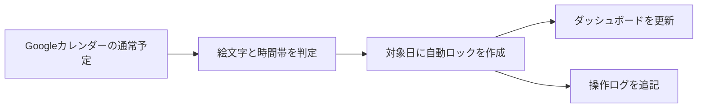

# Calendar Emoji Time Lock

Googleカレンダーの予定名に含まれる絵文字を検知し、その日の指定時間帯を自動でブロックする、Googleスプレッドシート紐づけ型のGoogle Apps Scriptです。

デフォルトでは、タイトルに `🍺` を含む予定が18:00以降に開始する、または18:00以降の時間帯に重なる場合、その日の18:00〜24:00へ次の予定を作成します。

```text
🔒 自動ロック｜夜間予定あり
```

## 目次

- [ツール概要](#ツール概要)
- [クイックスタート](#クイックスタート)
- [予定の判定仕様](#予定の判定仕様)
- [設定項目](#設定項目)
- [サイドバーの操作](#サイドバーの操作)
- [ダッシュボードと操作ログ](#ダッシュボードと操作ログ)
- [毎日実行トリガー](#毎日実行トリガー)
- [ダミーデータ](#ダミーデータ)
- [安全な削除設計](#安全な削除設計)
- [導入方法](#導入方法)
- [ファイル構成](#ファイル構成)
- [トラブルシューティング](#トラブルシューティング)
- [開発フロー](#開発フロー)

## ツール概要

予定の判定からダッシュボード更新まで、次の流れで動作します。



主な機能は次のとおりです。

- 今日から指定日数先までのカレンダー予定を判定
- タイトルに含まれる任意の絵文字・文字列を検知
- 判定開始時刻をまたぐ予定も対象化
- 対象日の指定時間帯へ「予定あり」の自動ロックを作成
- 既存ロックを安全に削除して再生成し、元予定の変更・削除を反映
- カレンダーID、判定条件、ロック時間、日次実行時刻をサイドバーで設定
- 最新結果、対象日一覧、曜日別件数をダッシュボードで可視化
- 設定変更や再判定などの実行履歴をログシートへ記録
- 動作確認用のダミー予定を作成・安全に削除

## クイックスタート

コードは次のGASプロジェクトへ配置済みです。

```text
スクリプトID: 1vTOQseBHEGan7OvfilZC_-okAhdiKaHFJLjw009lONSP8PwTKthV9gxO
タイムゾーン: Asia/Tokyo
```

対象のGoogleスプレッドシートで次の手順を行います。

1. スプレッドシートを再読み込みします。
2. メニューの「カレンダーロック」→「設定・操作パネルを開く」を選びます。
3. カレンダーIDや判定条件を確認し、「設定を保存」を押します。
4. 初回のみ、Googleカレンダー・スプレッドシート・トリガーの権限を承認します。
5. 「今すぐ再判定」を押します。
6. `カレンダーロック_ダッシュボード` と `カレンダーロック_ログ` シートを確認します。
7. 自動化する場合は、実行時刻を保存してから「毎日実行トリガーを設定」を押します。

メニューには入口だけを表示し、設定や実行操作はサイドバーへ集約しています。

## 予定の判定仕様

### デフォルトの判定

| 条件 | デフォルト |
| --- | --- |
| 判定文字列 | `🍺` |
| 判定開始時刻 | `18:00` |
| 判定期間 | 今日から31日後まで |
| 終日予定 | 対象外 |
| 自動ロック時間 | `18:00`〜`24:00` |

予定名に判定文字列が含まれ、その予定が対象日の判定開始時刻以降に少しでも重なる場合に対象となります。

| 予定 | 判定 | 理由 |
| --- | --- | --- |
| `取引先との会食 🍺` 17:00〜20:00 | 対象 | 18:00以降に重なる |
| `友人と飲み会 🍺` 19:00〜21:00 | 対象 | 18:00以降に開始する |
| `ランチ 🍺` 12:00〜13:00 | 対象外 | 18:00以降に重ならない |
| `プロジェクト会議` 19:00〜20:00 | 対象外 | 判定文字列がない |
| `終日イベント 🍺` | 対象外 | 初期設定では終日予定を除外 |

18:00ちょうどに終了する予定は、18:00以降の時間を占有しないため対象外です。

### 日付と24:00の扱い

- 判定期間の31日は「今日」と「31日後」を両方含みます。
- `24:00` は翌日の `00:00` としてカレンダーへ登録します。
- 18:00〜24:00のロックは、対象日の18:00から翌日0:00までの予定です。
- スクリプトのタイムゾーンは `Asia/Tokyo` です。

### 判定から除外する予定

- 判定文字列を含まない予定
- 判定開始時刻より前に終了する予定
- 「終日予定を対象にする」がオフの場合の終日予定
- このツール自身が作成した自動ロック予定

## 設定項目

設定は `PropertiesService.getUserProperties()` に保存されます。同じスプレッドシートを複数人で利用した場合も、設定はユーザーごとに分かれます。

| 項目 | デフォルト | 説明 |
| --- | --- | --- |
| カレンダーID | `primary` | メインカレンダー。共有カレンダーはカレンダーIDを入力 |
| 判定絵文字 | `🍺` | 予定名に含まれているか調べる文字列 |
| 自動生成予定名 | `🔒 自動ロック｜夜間予定あり` | 作成するロック予定のタイトル |
| 判定開始時刻 | `18:00` | この時刻以降に重なる予定を対象化 |
| ロック開始時刻 | `18:00` | 自動ロックの開始時刻 |
| ロック終了時刻 | `24:00` | 自動ロックの終了時刻。24:00は翌日0:00 |
| 判定期間の日数 | `31` | 今日から何日後まで判定するか。0〜365 |
| 終日予定を対象にする | オフ | オンの場合、判定文字列を含む終日予定も対象 |
| 既存ロックを削除して再生成 | オン | 元予定の変更・削除をロックへ反映 |
| 毎日実行時刻 | `03:00` | 日次トリガーの実行目安時刻 |

共有カレンダーを指定する場合は、Googleカレンダーの設定画面に表示されるカレンダーIDを入力してください。予定を作成・削除するため「予定の変更」以上の権限が必要です。

## サイドバーの操作

「カレンダーロック」→「設定・操作パネルを開く」から開きます。

| 操作 | 内容 |
| --- | --- |
| 設定を保存 | 入力値を検証し、ユーザー設定として保存 |
| 今すぐ再判定 | 予定を再取得し、自動ロックとダッシュボードを更新 |
| 毎日実行トリガーを設定 | 保存済み時刻で日次トリガーを作り直す |
| ダッシュボードを表示 | ダッシュボードシートへ移動 |
| ログシートを表示 | 操作ログシートへ移動 |
| ダミーデータを作成 | デモ用予定を20〜30件作成 |
| ダミーデータを削除 | デモ識別子を持つ予定だけを削除 |
| 自動生成予定を削除 | 自動ロックの二重識別条件に一致する予定だけを削除 |

実行中は全ボタンを無効化し、押したボタンを「処理中…」へ変更します。完了後は作成件数、削除件数、対象日数をカードで表示します。

削除操作では、サーバー処理を始める前に確認ダイアログを表示します。

## ダッシュボードと操作ログ

### ダッシュボード

手動または日次再判定が完了すると、`カレンダーロック_ダッシュボード` シートを自動作成・更新します。

表示内容は次のとおりです。

- 最終実行日時
- 作成件数
- 削除件数
- 対象日数
- 現在の絵文字・時刻・判定期間設定
- ロック対象日一覧
- 曜日別の対象日数
- 曜日別件数の棒グラフ

ダッシュボードは最新の再判定結果を表示します。履歴はログシートで確認してください。

### 操作ログ

`カレンダーロック_ログ` シートへ、処理のたびに1行ずつ追記します。

| 列 | 内容 |
| --- | --- |
| 実行日時 | Asia/Tokyoの実行日時 |
| 操作 | 設定保存、手動再判定、日次再判定、削除など |
| 状態 | 成功または失敗 |
| 作成件数 | 作成した予定・トリガーの件数 |
| 削除件数 | 削除した予定・トリガーの件数 |
| 対象日数 | ロック対象となった日数 |
| 詳細 | 完了メッセージまたはエラー内容 |
| 実行ユーザー | 取得可能な場合のGoogleアカウント |

ログ出力の失敗が、カレンダーの再判定や予定作成を止めることはありません。ログ側のエラーはApps Scriptの実行ログへ記録します。

時間主導トリガーでも同じスプレッドシートへ記録できるよう、最後に操作したスプレッドシートIDをユーザープロパティへ保存します。トリガー設定前に、対象スプレッドシートで一度サイドバーを開いて設定を保存してください。

## 毎日実行トリガー

1. サイドバーで「毎日実行時刻」を入力します。
2. 「設定を保存」を押します。
3. 「毎日実行トリガーを設定」を押します。

同じ `dailyRefreshCalendarLocks` のトリガーが存在する場合は削除し、新しいトリガーを1件だけ作成します。

Apps Scriptの時間主導型トリガーは秒単位・分単位で正確な開始を保証しません。このツールでは `atHour()` と `nearMinute()` を使用するため、実際の実行は指定時刻の前後約15分です。

実行時刻を変更した場合は、設定を保存しただけでは既存トリガーへ反映されません。もう一度「毎日実行トリガーを設定」を押してください。

## ダミーデータ

### 作成

サイドバーの「ダミーデータを作成」を押すと、今日から60日後までに20〜30件の予定をランダムに作成します。

予定時刻は次の候補から選ばれます。

- 09:00〜10:00
- 13:00〜14:00
- 17:00〜19:00
- 18:00〜20:00
- 19:00〜21:00
- 20:00〜22:00

説明欄には必ず次の識別子が入ります。

```text
DUMMY_EVENT_ID: CALENDAR_EMOJI_TIME_LOCK_DEMO
```

### 削除

「ダミーデータを削除」は、説明欄に上記識別子がある予定だけを削除します。通常予定と自動ロック予定は削除しません。

## 安全な削除設計

自動ロックの説明欄には次の識別子を保存します。

```text
SYSTEM_EVENT_ID: CALENDAR_EMOJI_TIME_LOCK
```

自動ロックの削除対象になるのは、次の両方を満たす予定だけです。

1. 予定名が現在設定されている自動生成予定名と完全一致する
2. 説明欄に `SYSTEM_EVENT_ID: CALENDAR_EMOJI_TIME_LOCK` が含まれる

このため、次の予定は削除されません。

- 同じタイトルを付けただけの手動予定
- 識別子だけを含み、タイトルが異なる予定
- 通常予定
- ダミー予定

自動生成予定名を変更する場合は、変更前の名前で「自動生成予定を削除」を実行してから、新しい名前を保存してください。安全性を優先しているため、変更後の名前では古いタイトルの自動ロックを削除できません。

## 導入方法

### 方法A：配置済みGASを利用する

このリポジトリのコードは次のスクリプトIDへ配置されています。

```text
1vTOQseBHEGan7OvfilZC_-okAhdiKaHFJLjw009lONSP8PwTKthV9gxO
```

対象スプレッドシートを再読み込みし、[クイックスタート](#クイックスタート)の手順で初期設定します。

### 方法B：GASエディタへ手動配置する

1. Googleスプレッドシートを作成します。
2. 「拡張機能」→「Apps Script」を開きます。
3. [ファイル構成](#ファイル構成)の `.gs` と `.html` を同名で作成します。
4. 各ファイルの内容を省略せず貼り付けます。
5. プロジェクト設定でマニフェストを表示し、`appsscript.json` を反映します。
6. スプレッドシートを再読み込みします。
7. サイドバーを開き、初回権限を承認します。

このツールはスプレッドシートに紐づくApps Scriptとして利用します。スタンドアロンスクリプトでは、スプレッドシートのカスタムメニューとサイドバーを表示できません。

### 方法C：claspで配置する

Node.jsとclaspを準備します。

```bash
npm install -g @google/clasp
clasp login
clasp show-authorized-user
```

このプロジェクトの利用アカウントは `nakashima.keitarou@gmail.com` です。

リポジトリ直下へ、Git管理対象外の `.clasp.json` を作成します。

```json
{
  "scriptId": "1vTOQseBHEGan7OvfilZC_-okAhdiKaHFJLjw009lONSP8PwTKthV9gxO",
  "rootDir": "."
}
```

接続先と送信対象を確認してからpushします。

```bash
clasp versions
clasp status
clasp push
clasp open
```

`clasp push --force` はリモートのマニフェストやファイル構成を上書きします。既存コードをcloneまたはバックアップしてから使用してください。

## 必要な権限

初回実行時に、利用するGoogleアカウントで権限承認が必要です。

- 対象Googleカレンダーの予定の閲覧・作成・削除
- スプレッドシートの閲覧・編集
- ユーザープロパティへの設定保存
- 時間主導型トリガーの作成・管理

組織のGoogle WorkspaceポリシーによってApps Scriptやカレンダー権限が制限されている場合は、管理者へ確認してください。

## ファイル構成

| ファイル | 役割 |
| --- | --- |
| `Code.gs` | カスタムメニュー、サイドバー、画面遷移 |
| `CalendarService.gs` | 予定判定、自動ロック作成、安全な削除 |
| `SettingsService.gs` | 定数、デフォルト設定、保存、入力検証 |
| `TriggerService.gs` | 日次トリガーの作成・重複削除 |
| `DemoDataService.gs` | ダミー予定の作成・削除 |
| `DashboardService.gs` | ダッシュボード、グラフ、操作ログ |
| `Sidebar.html` | サイドバーのHTML構造 |
| `Styles.html` | サイドバーのデザイン |
| `JavaScript.html` | サイドバーのクライアント処理 |
| `appsscript.json` | Asia/Tokyo、V8ランタイム設定 |
| `.gitignore` | `.clasp.json` などのローカルファイル除外 |

HTMLは `include()` を使い、`Sidebar.html` から `Styles.html` と `JavaScript.html` を読み込みます。

## トラブルシューティング

### 「カレンダーロック」メニューが表示されない

- スプレッドシートを再読み込みしてください。
- Apps Scriptが対象スプレッドシートに紐づいていることを確認してください。
- Apps Scriptエディタで `onOpen` を実行し、エラーがないか確認してください。

### カレンダーを取得できない

- メインカレンダーは `primary` を指定します。
- 共有カレンダーはGoogleカレンダー設定画面の正確なカレンダーIDを入力します。
- 共有カレンダーに「予定の変更」以上の権限があるか確認します。

### 権限エラーになる

- Apps Scriptエディタから `showSidebar` または `refreshCalendarLocks` を一度実行します。
- 表示されたGoogleの権限確認を完了します。
- 複数Googleアカウントへログインしている場合は、実行アカウントを確認します。

### ダッシュボードやログシートが作られない

- 対象スプレッドシートでサイドバーを開き、「設定を保存」してください。
- 「今すぐ再判定」を実行してください。
- Apps Scriptの「実行数」画面で `DashboardService` のエラーを確認してください。
- ログ出力エラーは本体処理を止めないため、カレンダー処理が成功してもシートだけ作られない場合があります。

### 日次トリガーが実行されない

- 時刻を保存した後、「毎日実行トリガーを設定」を押したか確認してください。
- Apps Scriptの「トリガー」画面に `dailyRefreshCalendarLocks` が1件あるか確認してください。
- 指定時刻ぴったりではなく、前後約15分に実行されます。
- トリガーを作成したGoogleアカウントの権限が失効していないか確認してください。

### `24:00`を入力できない

ロック終了時刻だけは文字入力欄です。半角で `24:00` と入力してください。判定開始時刻、ロック開始時刻、毎日実行時刻には `24:00` を指定できません。

### 元予定を削除しても自動ロックが残る

「既存ロックを削除して再生成」がオンであることを確認し、「今すぐ再判定」を実行してください。

### 古い名前の自動ロックが残る

いったん自動生成予定名を以前の名前へ戻して保存し、「自動生成予定を削除」を実行します。その後、新しい予定名を保存してください。

### claspの接続先が違う

次のコマンドでアカウントとスクリプトIDを確認します。

```bash
clasp show-authorized-user
clasp status
```

`.clasp.json` の `scriptId` が、このREADMEに記載されたIDと一致しているか確認してください。

## 開発フロー

GitHubリポジトリは [groundcobra009/calendar-emoji-time-lock-gas](https://github.com/groundcobra009/calendar-emoji-time-lock-gas) です。

このプロジェクトはIssue駆動で開発します。

1. コードを書く前に、目的・スコープ・受け入れ基準・テスト計画を含むIssueを作成します。
2. `issue-N-short-english-name` 形式のブランチを作成します。
3. 判断、ハマりどころ、検証結果をIssueコメントの「知見ログ」へ追記します。
4. 構文検査、モックテスト、`git diff --check`、clasp送信対象確認を実行します。
5. コミットへ `Refs #N`、PR本文へ `Closes #N` を記載します。
6. PRのマージ可否を確認してからマージします。

```bash
git switch -c issue-N-short-english-name
git add path/to/changed-file
git commit -m "feat: 変更内容 Refs #N"
git push -u origin issue-N-short-english-name

gh pr create \
  --title "【calendar-emoji-time-lock-gas】日本語タイトル" \
  --body "Closes #N"
```

`.clasp.json` は環境固有の接続設定を含むため、Gitへコミットしません。
